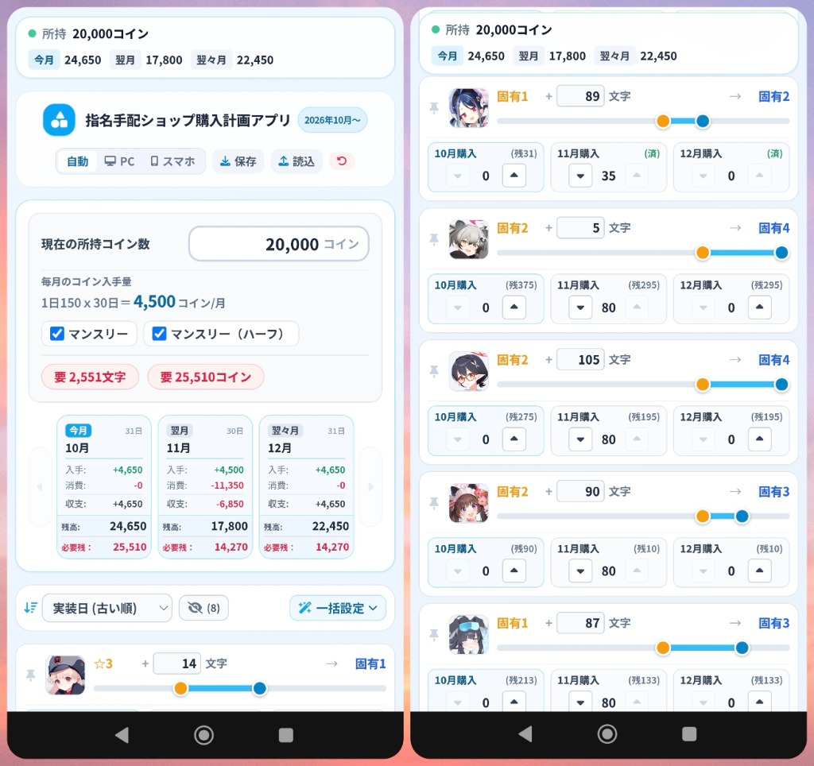

# ブルーアーカイブ 指名手配ショップ購入計画アプリ

ブルーアーカイブ（ブルアカ）の指名手配ショップにおける神名文字の購入計画とコイン収支を計算・管理できるWEBツールです。

🔗 **Webアプリを開く**  
👉 **https://roundabout-oxygen.github.io/ba-wantedcoin/**

---

## 主な機能

- **所持コイン・月間収支シミュレーション**  
  現在の所持コイン数とマンスリーパッケージの有無から、毎月の獲得コイン・消費コイン・残高をリアルタイム計算します。
- **星上げ・必要文字数計算**  
  生徒の現在の星・所持文字数から、目標星（固有1〜固有4）に必要な文字数を自動計算します。
- **3ヶ月購入計画**  
  今月・翌月・翌々月の購入数をワンタップでシミュレーションできます。
- **未追加生徒の表示切替**  
  まだ指名手配ショップに並んでいない生徒は、フィルター（PC: チェックボックス / スマホ: 目のアイコン）で簡単に非表示・表示を切り替えられます。
- **PC・スマホ両対応**  
  画面幅に応じた最適表示に加え、手動での表示切り替えにも対応しています。
- **保存・読込（バックアップ）**  
  設定内容はJSONファイルとしてエクスポート・インポートが可能です。

---

## プライバシー・データ管理について

- 入力した設定内容は**すべてお使いのブラウザ（ローカルストレージ）内にのみ保存**されます。
- 外部サーバーへの通信やデータ収集などは一切行いませんので、安心してお使いいただけます。

---

## 使い方

1. **基本設定**  
   現在の所持コイン数とマンスリーパッケージの加入状況を選択します。
2. **星上げ目標の設定**  
   育てたい生徒の目標星や現在の所持文字数を設定します。
3. **購入計画の入力**  
   各月の購入個数を調整し、コイン残高や必要残コインを確認します。
